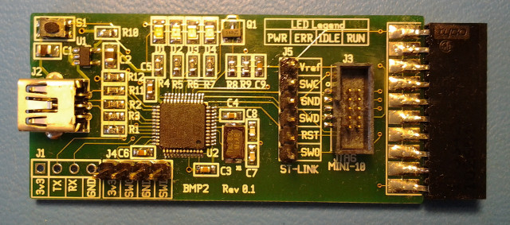

# EMEB_BMP2

#### EMEB_BMP2 assembled board

### What is it?

This is a revised layout for the original Black Magic Probe Mini from
Blacksphere which provides connections for several styles of JTAG connectors.
In addition to the 10-pin mini JTAG found on the original, it also has connections
compatible with the original 20-pin 0.1" pitch JTAG connector as well as the
ST-Link 6-pin 0.1" single row header.

Other than the addition of these connectors and a revised layout that's more
suited for DIY assembly, nothing has been changed. Original BMPM firmware is
100% compatible.

### Resources
* [Black Magic Probe (BMP)](https://1bitsquared.com/collections/embedded-hardware/products/black-magic-probe)
 Latest BMP web site.

### Design Resources
* gEDA schematic: [bmp2.sch](bmp2.sch)
* PCB layout: [bmp2.pcb](bmp2.pcb)
* Schematic PDF: [bmp2.pdf](bmp2.pdf)
* Bill of Materials: [bom.xls](bom.xls)
* Gerbers (in OSHpark format): [bmp2.zip](bmp2.zip)

## Status
* 11-08-12 - Schematic revised and layout started.
* 11-12-12 - PCB design sent to fab.
* 12-13-12 - PCB back from fab, assembled, tested, works.
* 03-11-13 - Posted gerbers.

##### 
**Last Updated**
:2013-03-11

##### 
**Comments to:**
[Eric Brombaugh](mailto:ebrombaugh1@cox.net)

